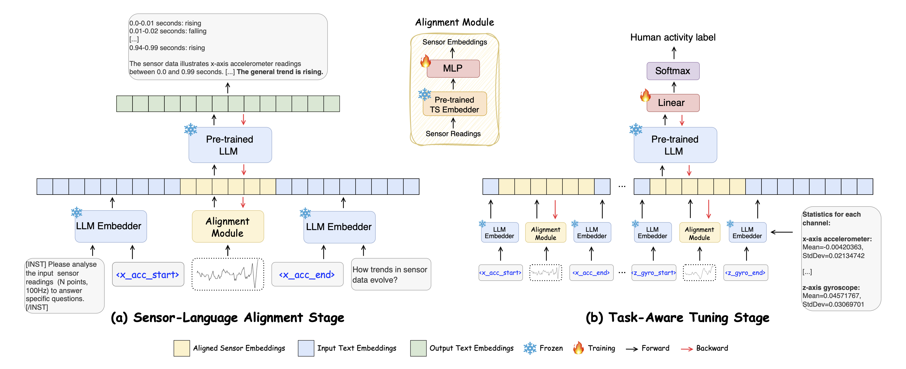

<h1 align="center"><strong> SensorLLM</strong></h1>
<h1 align="center"><strong> Human-Intuitive Alignment of Multivariate Sensor Data with LLMs for Activity Recognition</strong></h1>
  <p align="center">
    <a href='https://scholar.google.com/citations?user=EVOzBF4AAAAJ&hl=en' target='_blank'>Zechen Li</a><sup>1</sup>&emsp;&emsp;
    <a href='https://scholar.google.com/citations?user=250tnREAAAAJ&hl=en' target='_blank'>Shohreh Deldari</a><sup>1</sup>&emsp;&emsp;
    <a href='https://openreview.net/profile?id=~Linyao_Chen1' target='_blank'>Linyao Chen</a><sup>2</sup>&emsp;&emsp;
    <a href='https://scholar.google.com/citations?user=KwhLl7IAAAAJ&hl' target='_blank'>Hao Xue</a><sup>1</sup>&emsp;&emsp;
    <a href='https://fsalim.github.io' target='_blank'>Flora D. Salim</a><sup>1</sup>
    <br><br>
    <sup>1</sup> University of New South Wales, Sydney<br/>
    <sup>2</sup> University of Tokyo
    <br><br>
    <a href="https://arxiv.org/abs/2410.10624">
        
    </a>
  </p>


## 🌟 Overview

**SensorLLM** is a two-stage framework that aligns sensor time series with human-intuitive text, enabling LLMs to interpret complex numerical data and achieve SOTA human activity recognition across varying sensor types, counts, and sequence lengths.
<div style="text-align: center;">
    
</div>

### 🔑 Key Features
- Aligns sensor time-series with ***human-intuitive, annotation-free*** textual trend descriptions and summaries via a QA-based framework.
- ***Sensor–Language Alignment Stage*** operates on single-channel, variable-length segments for fine-grained trend-text alignment.
- ***Task-Aware Tuning Stage*** handles multi-channel, multi-sensor data for downstream human activity recognition (HAR).

### 📂 Datasets
The current implementation supports five HAR datasets: USC-HAD, UCI-HAR, MHealth, Capture-24, and PAMAP2.

To apply SensorLLM to other datasets, please refer to the code and configuration examples provided for the supported datasets. In particular, you may need to modify the corresponding entries in [`ts_backbone.yaml`](./sensorllm/model/ts_backbone.yaml) and adapt the data loading logic in the [`./sensorllm/data`](./sensorllm/data) folder to match your dataset’s format.


## 🚀 Getting started

> Currently supported pretrained models:
> - Time-series models: [Chronos](https://arxiv.org/abs/2403.07815)  
> - Language models: [LLaMA](https://arxiv.org/abs/2407.21783)  
> 
> Other pretrained models **can be used with minor modifications to the SensorLLM framework**.


### Sensor-Language QA Pairs Generation
We provide two example notebooks to generate QA pairs for aligning sensor time-series data with human-intuitive text:
- [`mhealth_stage1.ipynb`](./mhealth_stage1.ipynb): Generates QA pairs for Stage 1 by aligning single-channel sensor segments with trend-based natural language descriptions.
- [`mhealth_stage2.ipynb`](./mhealth_stage1.ipynb): Generates statistical information text for Stage 2, performing HAR classification using multi-channel sensor data.

You can also customize or extend the QA templates in these notebooks to generate more diverse types of sensor–language QA pairs for your own use cases.

### Sensor–Language Alignment
To align sensor time-series data with text, run the following command:

```bash
torchrun --nproc_per_node=[NUM_GPUS] sensorllm/train/train_mem.py   \
--model_name_or_path [LLM_PATH] \
--pt_encoder_backbone_ckpt [TS_EMBEDDER_PATH]   \
--tokenize_method 'StanNormalizeUniformBins'    \
--dataset [DATASET_NAME] \
--data_path [TS_TRAIN_PATH]   \
--eval_data_path [TS_EVAL_PATH]   \
--qa_path [QA_TRAIN_PATH]   \
--eval_qa_path [QA_EVAL_PATH]   \
--output_dir [OUTPUT_PATH]    \
--model_max_length [MAX_LEN]    \
--num_train_epochs [EPOCH]    \
--per_device_train_batch_size [TRAIN_BATCH]    \
--per_device_eval_batch_size [EVAL_BATCH]    \
--evaluation_strategy "steps"    \
--save_strategy "steps"    \
--save_steps [SAVE_STEPS]    \
--eval_steps [EVAL_STEPS]    \
--learning_rate 2e-3   \
--weight_decay 0.0   \
--warmup_ratio 0.03   \
--lr_scheduler_type "cosine"   \
--logging_steps 1   \
--gradient_checkpointing True   \
--save_total_limit 1    \
--bf16 True    \
--fix_llm True   \
--fix_ts_encoder True   \
--model_type CasualLM   \
--load_best_model_at_end True  
```

### Evaluation or Inference
To perform evaluation or inference for the Sensor–Language Alignment stage, run the following command:

```bash
python sensorllm/eval/eval.py   \
--model_name_or_path [STAGE1_MODEL_PATH]  \
--pt_encoder_backbone_ckpt [TS_EMBEDDER_PATH]   \
--torch_dtype bfloat16	\
--tokenize_method 'StanNormalizeUniformBins'    \
--dataset [DATASET_NAME] \
--data_path [TS_DATASET_PATH]   \
--qa_path [QA_DATASET_PATH]  \
--output_file_name [OUTPUT_FILE_NAME]	\
--model_max_length [MAX_LEN]	\
--shuffle False
```

### Task-Aware Tuning 
To perform a HAR task, use the following command:
```bash
torchrun --nproc_per_node=[NUM_GPUS] sensorllm/train/train_mem.py   \
--model_name_or_path [STAGE1_MODEL_PATH] \
--pt_encoder_backbone_ckpt [TS_EMBEDDER_PATH]   \
--model_type "SequenceClassification" \
--num_labels [ACTIVITY_NUM]  \
--use_weighted_loss True  \
--tokenize_method 'StanNormalizeUniformBins'    \
--dataset [DATASET_NAME] \
--data_path [TS_TRAIN_PATH]   \
--eval_data_path [TS_EVAL_PATH]   \
--qa_path [QA_TRAIN_PATH]   \
--eval_qa_path [QA_EVAL_PATH]   \
--output_dir [OUTPUT_PATH]    \
--model_max_length [MAX_LEN]    \
--num_train_epochs [EPOCH]    \
--num_train_epochs [EPOCH]    \
--per_device_train_batch_size [TRAIN_BATCH]    \
--per_device_eval_batch_size [EVAL_BATCH]    \
--evaluation_strategy "steps"    \
--save_strategy "steps"    \
--save_steps [SAVE_STEPS]    \
--eval_steps [EVAL_STEPS]    \
--save_total_limit 1    \
--load_best_model_at_end True    \
--learning_rate 2e-3    \
--weight_decay 0.0    \
--warmup_ratio 0.03    \
--lr_scheduler_type "cosine"    \
--logging_steps 1    \
--bf16 True      \
--fix_llm True  \
--fix_cls_head False  \
--fix_ts_encoder True    \
--gradient_checkpointing True    \
--metric_for_best_model  "f1_macro" \
--preprocess_type "smry+Q" \
--greater_is_better True  \
--stage_2 True  \
--shuffle True
```
See [`./sensorllm/data/utils.py`](./sensorllm/data/utils.py) for all available preprocess_type options or to make edits.

## 🌍 Citation

If you find this repository useful for your research, please cite our paper:

```
@misc{li2025sensorllmhumanintuitivealignmentmultivariate,
      title={SensorLLM: Human-Intuitive Alignment of Multivariate Sensor Data with LLMs for Activity Recognition}, 
      author={Zechen Li and Shohreh Deldari and Linyao Chen and Hao Xue and Flora D. Salim},
      year={2025},
      eprint={2410.10624},
      archivePrefix={arXiv},
      primaryClass={cs.CL},
      url={https://arxiv.org/abs/2410.10624}, 
}
```

## 📄 License

<a rel="license" href="http://creativecommons.org/licenses/by-nc-sa/4.0/"></a>
<br />
This work is under the <a rel="license" href="http://creativecommons.org/licenses/by-nc-sa/4.0/">Creative Commons Attribution-NonCommercial-ShareAlike 4.0 International License</a>.


## 📩 Contact

If you have any questions or suggestions, feel free to contact Zechen at `zechen.li(at)unsw(dot)edu(dot)au`.
